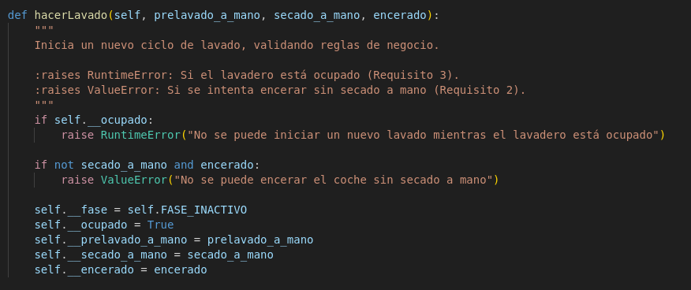
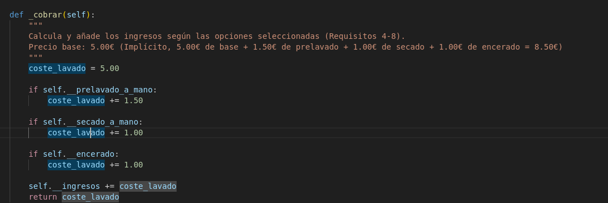

primer error de depuracion de main 

corregimos el error de main 

tambien esta el fallo forzado del caso 3

capturas tests

para empezar, resvisando lavadero, tiene este nombre de la funcion mal 

el nombre de la funcion es este

todos los fallos de los tests

las fases están al reves test 10/11/13/14/9

solucion 

faltan condiciones test 12/13/14

el secado a mano debe llevar a enceraado

aqui pone RuntimeError cuando es ValueError  test 3

solucion

aqui tenemos estas tarifas, pero difieren de las esperadas en los tests test 5/7

al parecer hay mas errores con los precios que no saltaron antes porque el fallo que solucione evitaba el que salto ahora

ahora hay que aumentar el precio del enceraado para compensar 

corregimos

sin errores

