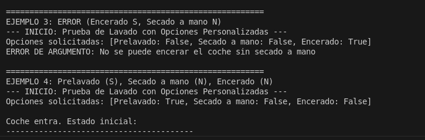
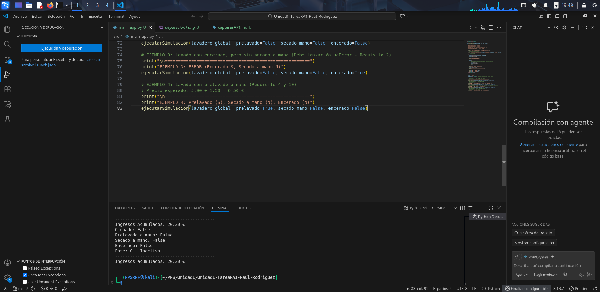

# Ejecución y depuración del código en Visual Studio Code

En este documento se describen los pasos seguidos para ejecutar y depurar la aplicación `lavadero` utilizando Visual Studio Code como entorno de desarrollo.

---

## 1. Abrir el proyecto en VS Code

1. Abrir Visual Studio Code.
2. Seleccionar el menú **File → Open Folder...**.
3. Elegir la carpeta raíz del proyecto.

---

## 2. Ejecutar el programa desde VS Code

1. Abrir el archivo principal de la aplicación, por ejemplo `src/main_app.py`.
2. En la esquina superior derecha del editor, usar el botón **Run Python File** o pulsar:
   - `Ctrl+F5` para ejecutar sin depurar.
3. Verificar que la salida aparece en el panel **Terminal** integrado de VS Code, usando el entorno virtual seleccionado.

---

## 4. Configurar la depuración 

1. Abrir la vista **Run and Debug** desde la barra lateral izquierda (icono del triángulo con el bicho) o con `Ctrl+Shift+D`.
2. Pulsar el botón **Run and Debug**.
3. Seleccionar **Python Debugger** y luego la opción **Python File**.

---
## 5. Capturas de pantalla

A continuación se incluyen las capturas de pantalla utilizadas como evidencia de la depuración en Visual Studio Code:

Aqui podemos ver el error, y al solucionarlo se ejecuta sin problemas

