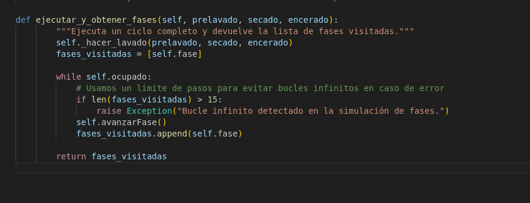
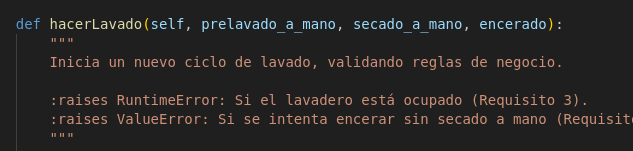
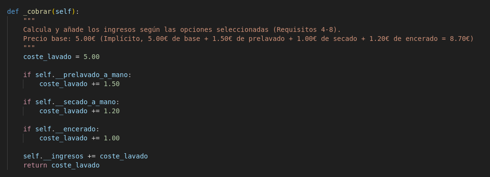
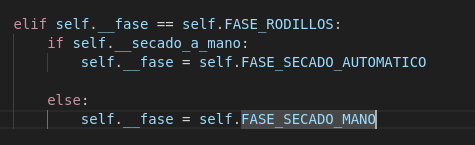
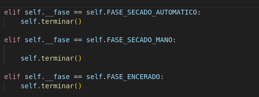
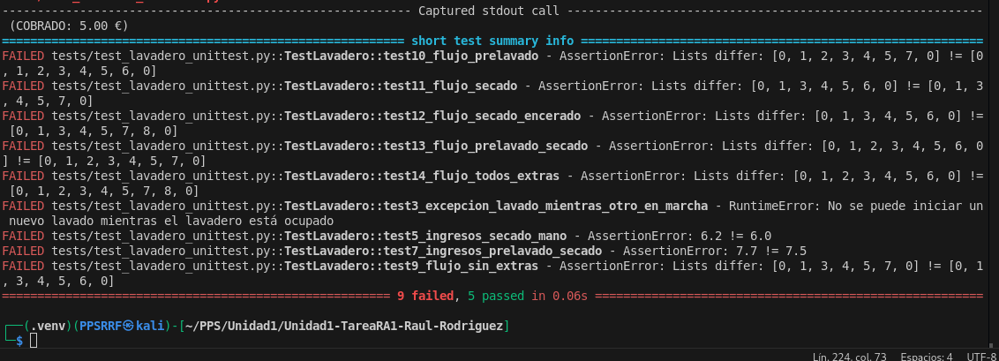
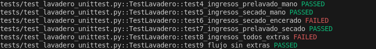
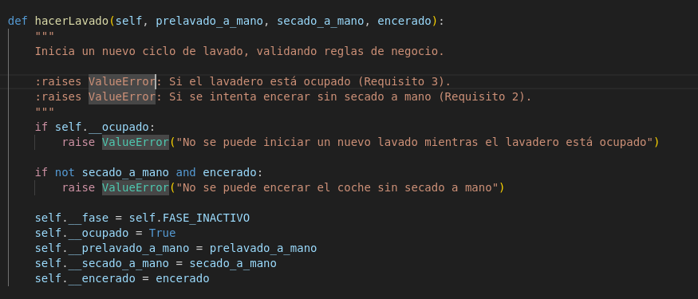
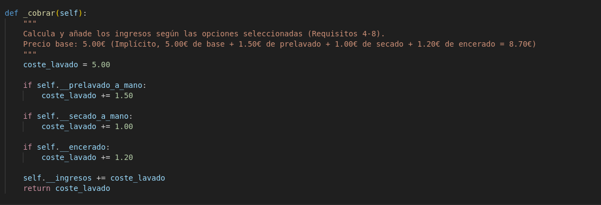

# Ejecución de tests con pytest desde la línea de comandos

En esta sección se documenta cómo crear y usar un entorno virtual (`venv`) y cómo ejecutar los tests del proyecto utilizando `pytest` desde terminal con el comando `PYTHONPATH=. pytest tests/test_lavadero_unittest.py -v`.

## Crear el entorno virtual

Desde la raíz del proyecto, crea un entorno virtual llamado `venv` con:

```
python3 -m venv venv
```

Este comando genera una carpeta `venv/` con una instalación aislada de Python y sus paquetes.

## Activar el entorno virtual

Cada vez que vayas a trabajar con el proyecto (instalar paquetes o lanzar tests), activa el entorno virtual:

```
source venv/bin/activate
```

Al activarlo, el intérprete y los paquetes que se usarán serán los de `venv`, no los del sistema.

Si aún no lo has hecho en este entorno, instala `pytest` una vez:

```
pip install pytest
```

## Ejecutar el fichero de tests principal

Con el `venv` activado y situado en la raíz del proyecto, ejecuta el fichero de tests `tests/test_lavadero_unittest.py` con:

```
PYTHONPATH=. pytest tests/test_lavadero_unittest.py -v
```

Al finalizar, se mostrará un resumen con el número de tests ejecutados y cuántos han pasado o fallado.

## Ciclo de depuración con pytest

Durante la corrección de errores el ciclo habitual es:

1. Activar el entorno virtual (si no lo está):  
   ```
   source venv/bin/activate
   ```
2. Modificar el código de la aplicación o del test.
3. Guardar los cambios.
4. Volver a lanzar los tests con:

   ```
   PYTHONPATH=. pytest tests/test_lavadero_unittest.py -v
   ```

De este modo validas rápidamente si los cambios han corregido el fallo sin necesidad de ejecutar toda la suite de tests completa.

## Evidencias gráficas

A continuación se incluyen capturas relacionadas con la ejecución de tests, la aparición de fallos y sus soluciones.  
Se asume que las imágenes están ubicadas en la carpeta `docs/img/` del proyecto.


### Fallo visto antes de empezar con los tests

El nombre del método estaba mal, y no se hace bien la llamada al método

  

  

### Capturas de fallos en los tests

  
  
  
  
  
  
Al ejecutar el test por primera vez, dio varios errores que fueron solucionados, pero uno de esos errores, corregía otros 2 errores que había con el precio, por lo que al ejecutar por segunda vez los tests, salieron esos fallos
  

### Capturas de y soluciones

  
  
  
  
  
Una vez el test se ejecuta varias veces, y se solucionan los errores que van surgiendo, obetenemos el resultado de los tests como PASSED
  
